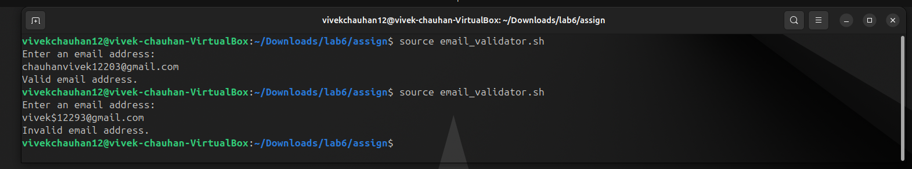

# <h1 style="background-color: orange;"> ASSIGNMENT 1</h1>

---------------------------------------------------------------------------
### <h1 style="background-color: pink;"> TASK 1</h1>
 ####  Write a function to calculate the factorial of a number using a loop.  
 #### Script:
   
  
 #### Output:
   

---------------------------------------------------------------------------
### <h1 style="background-color: pink;"> TASK 2</h1>
 #### Write a script that reads a filename and counts how many times a given word appears in it.  
 #### Script:
   
  
 #### Output:
   

---------------------------------------------------------------------------
### <h1 style="background-color: pink;"> TASK 3</h1>
 #### Write a script that generates the first N Fibonacci numbers using a while loop.   

 #### Script:
   
  
 #### Output:
   

---------------------------------------------------------------------------
### <h1 style="background-color: pink;"> TASK 4</h1>
 #### Write a script that validates whether the entered string is a proper email address using a regular expression.  

 #### Script:
   
  
 #### Output:
   

---------------------------------------------------------------------------
### <h1 style="background-color: pink;"> TASK 5</h1>
 #### Write a script with an international error, run it with `bash -x `, and explain the debug output.  

 #### Script:
   
  
 #### Output:
   

 #### Explanation:
  - Lines starting with + show each command before running it.
  - The mistake: the script uses `$nme` instead of `$name` → so it's empty.
  - echo "Hello, $nme!" prints Hello, ! with nothing after comma.
  - Debug mode helps spot that the wrong variable is used.

---------------------------------------------------------------------------
