# <h1 style="background-color: orange;"> ASSIGNMENT 1</h1>

---------------------------------------------------------------------------
### <h1 style="background-color: pink;"> TASK 1</h1>
 #### Write a script that monitors the top 5 processesconsuming the most CPU and logs them into a file every 10 seconds.  
 #### Script:
 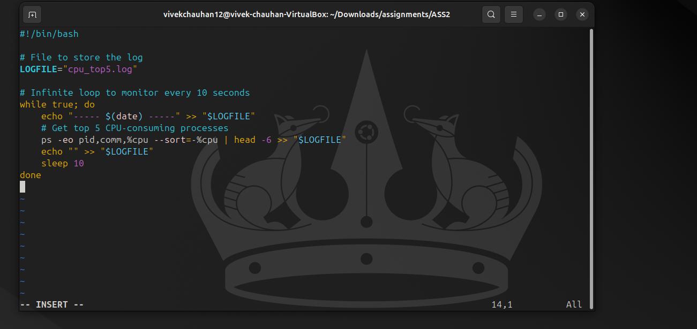  
  
 #### Output:
 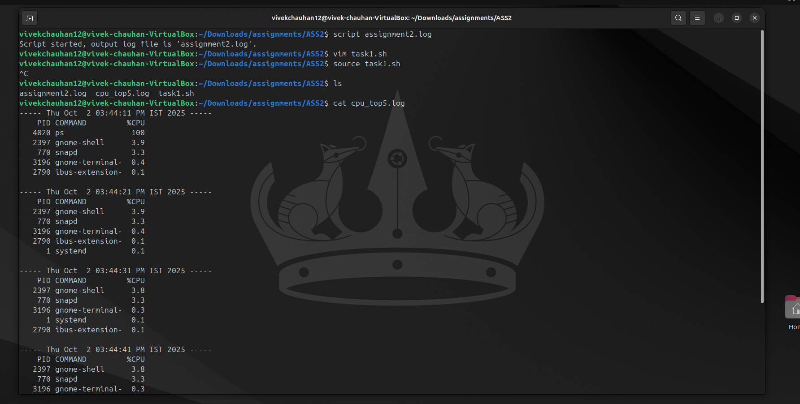  

---------------------------------------------------------------------------
### <h1 style="background-color: pink;"> TASK 2</h1>
 #### Write a script that accepts a PID from the user and displays its details (state, parent process, memory usage).  
 #### Script:
 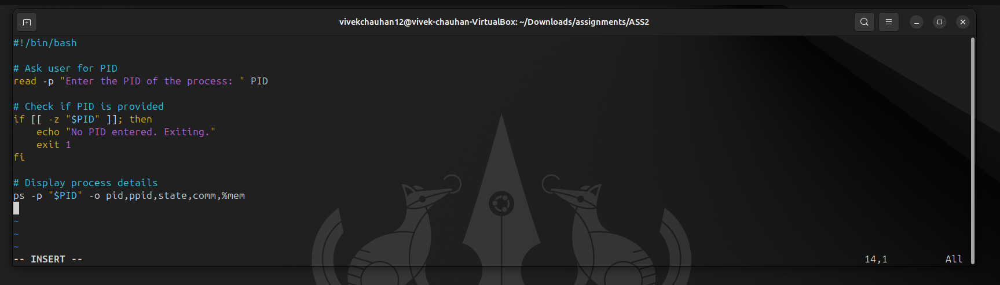  
  
 #### Output:
 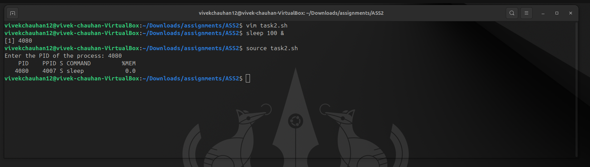  

---------------------------------------------------------------------------
### <h1 style="background-color: pink;"> TASK 3</h1>
 #### Create a script that schedules a task to append the current date and time to log a file every minute using cron.  
 #### Script:
 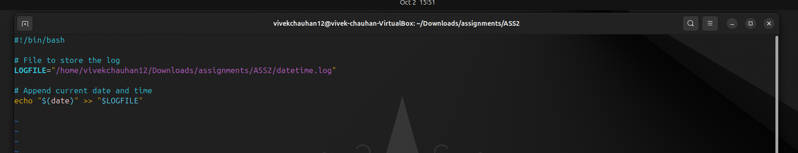  

 #### `crontab -e`
 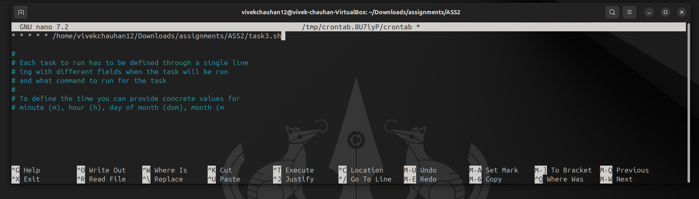  
  
 #### Output:
 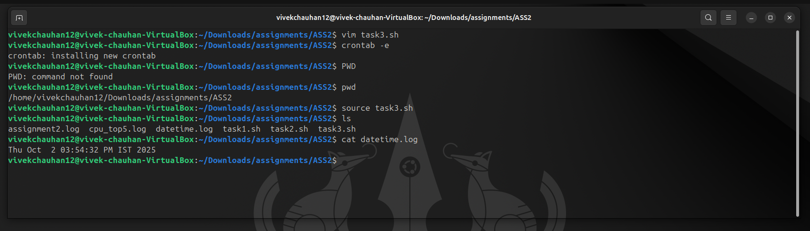  

---------------------------------------------------------------------------
### <h1 style="background-color: pink;"> TASK 4</h1>
 #### Modify the factorial function to check if input is negative. If yes display an error message.  
 #### Script:
 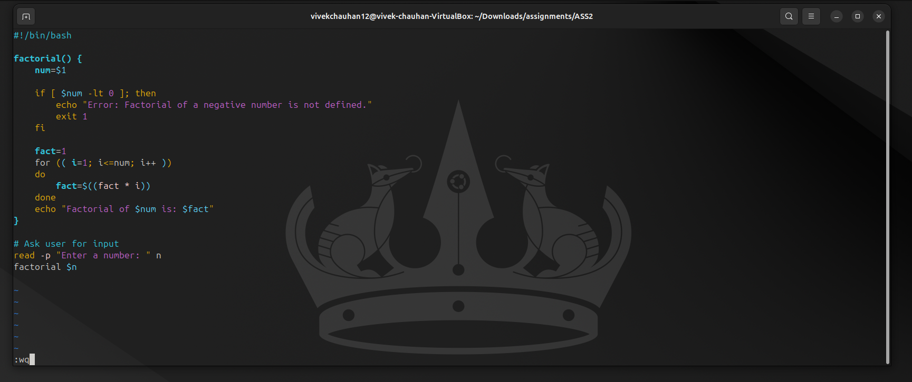  
  
 #### Output:
 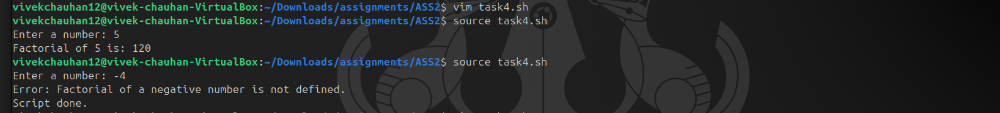  

---------------------------------------------------------------------------
### <h1 style="background-color: pink;"> TASK 5</h1>
 #### Write a script that accepts a filename as an argument. If the file exists display the number of lines starting with the vowel.  
 #### Script:
 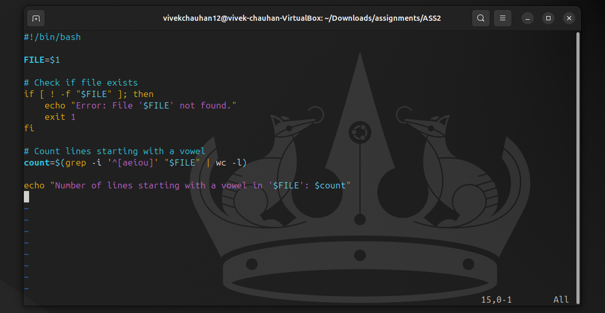  
  
 #### Output:
 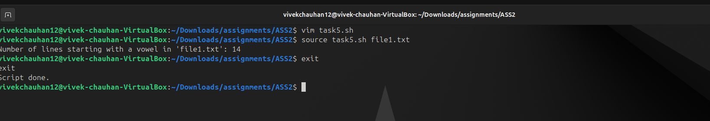  

---------------------------------------------------------------------------
---------------------------------------------------------------------------
