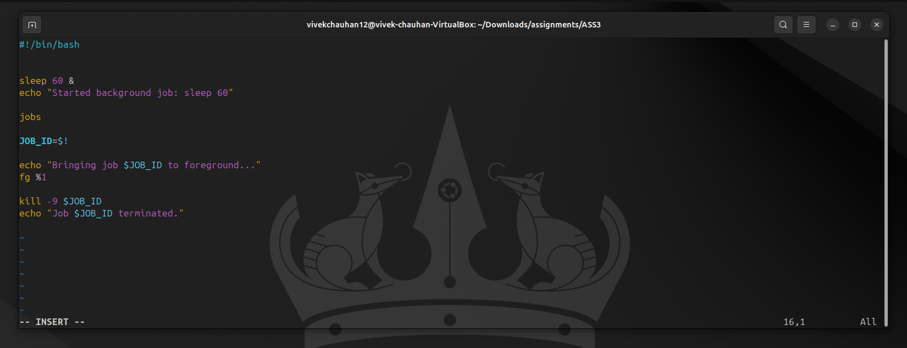
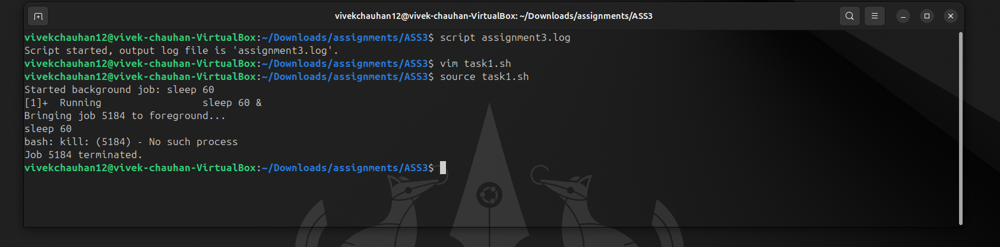
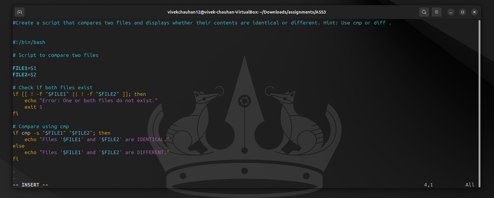
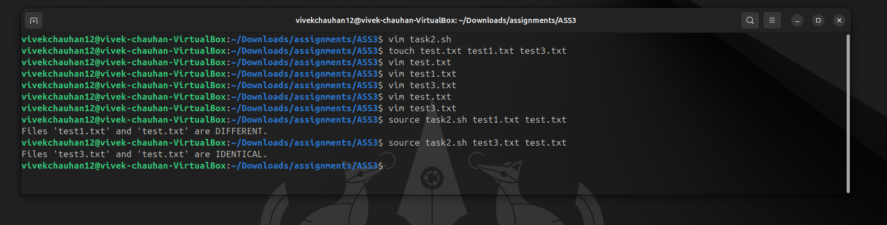
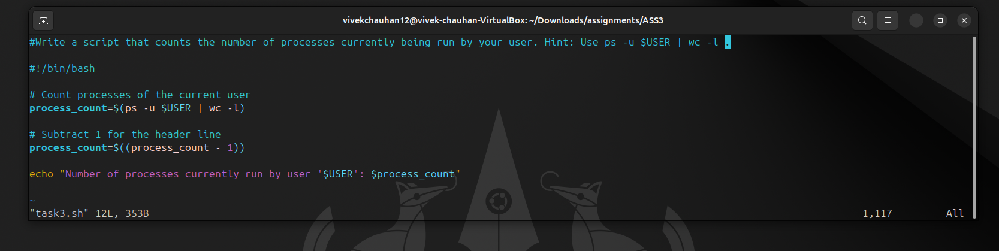
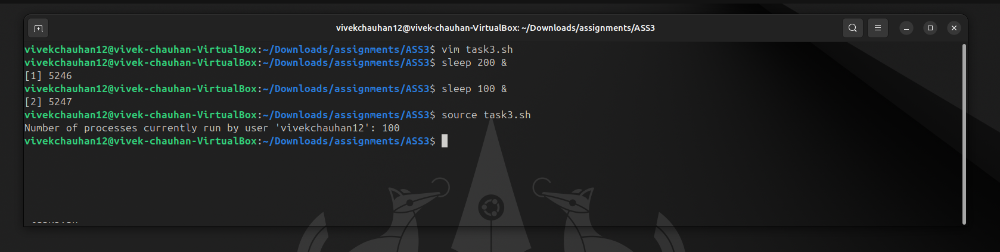
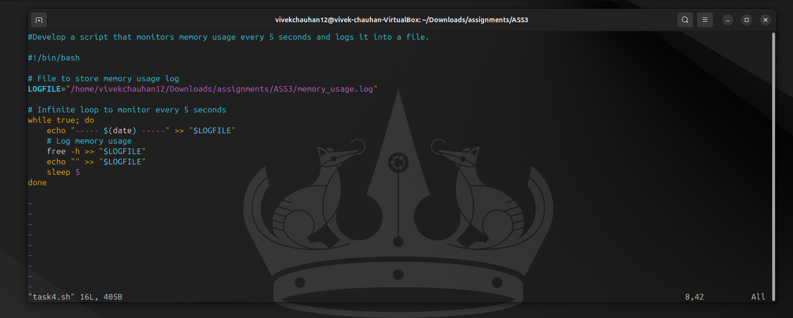
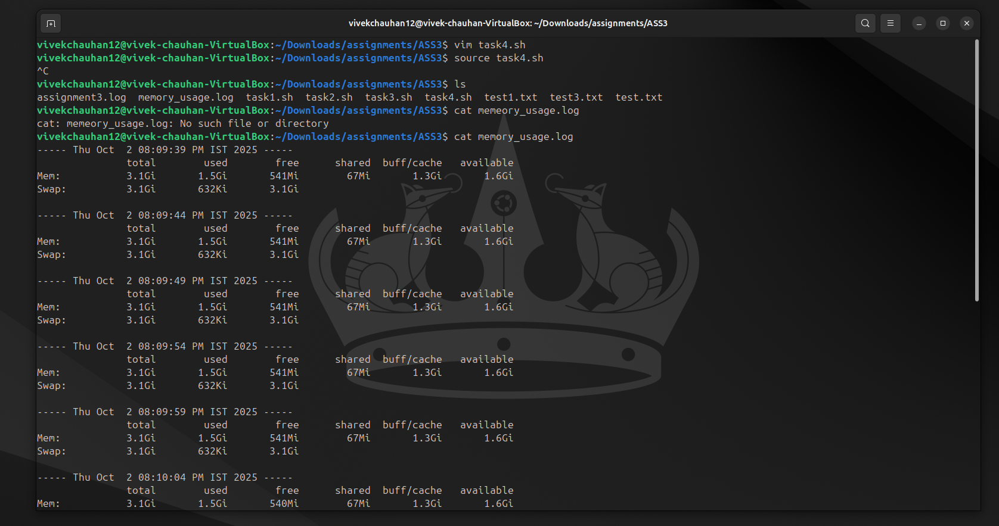
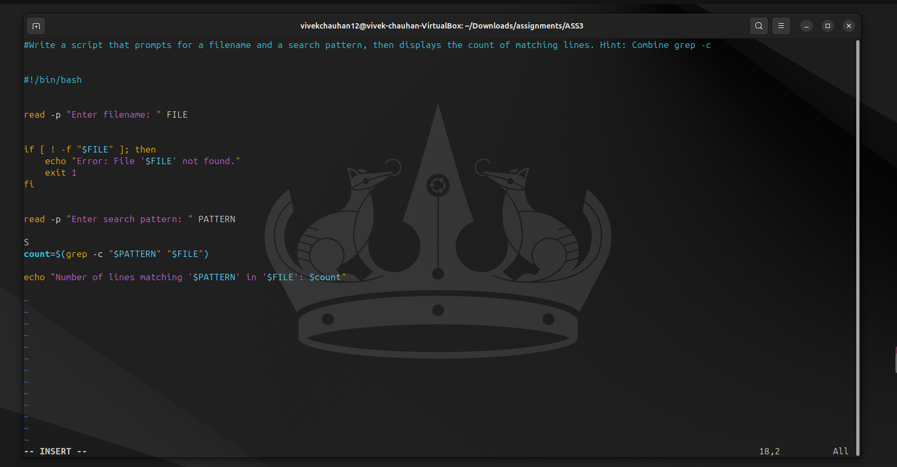
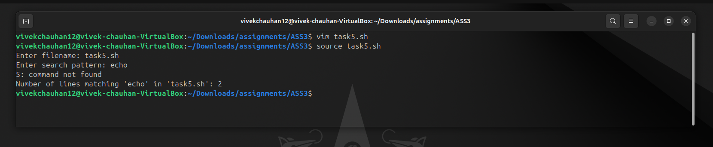

# <h1 style="background-color: orange;"> ASSIGNMENT 3</h1>

---------------------------------------------------------------------------
### <h1 style="background-color: pink;"> TASK 1</h1>
 #### Write a script that starts a background job (e.g., sleep 60 ), lists all jobs, brings the job to the foreground, and then terminatesit  
 #### Script:
   
  
 #### Output:
   

---------------------------------------------------------------------------
### <h1 style="background-color: pink;"> TASK 2</h1>
 #### Create a script that compares two files and displays whether their contents are identical or different.  
 #### Script:
   
  
 #### Output:
   

---------------------------------------------------------------------------
### <h1 style="background-color: pink;"> TASK 3</h1>
 #### Write a script that counts the number of processes currently being run by your user.  
 #### Script:
   

 #### Output:
   

---------------------------------------------------------------------------
### <h1 style="background-color: pink;"> TASK 4</h1>
 #### Develop a script that monitors memory usage every 5 seconds and logs it into a file.  
 #### Script:
   
  
 #### Output:
   

---------------------------------------------------------------------------
### <h1 style="background-color: pink;"> TASK 5</h1>
 #### Write a script that prompts for a filename and a search pattern, then displays the count of matching lines.  
 #### Script:
   
  
 #### Output:
   

---------------------------------------------------------------------------
---------------------------------------------------------------------------
