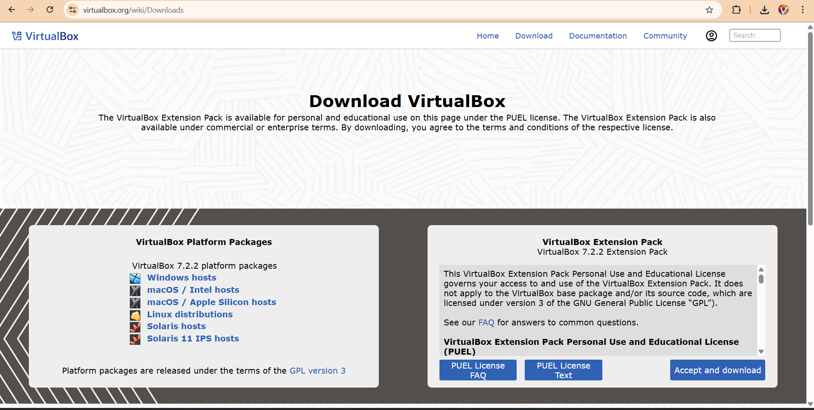
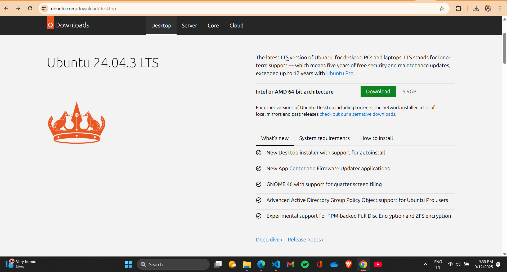
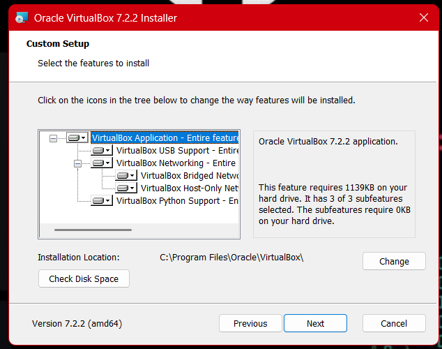
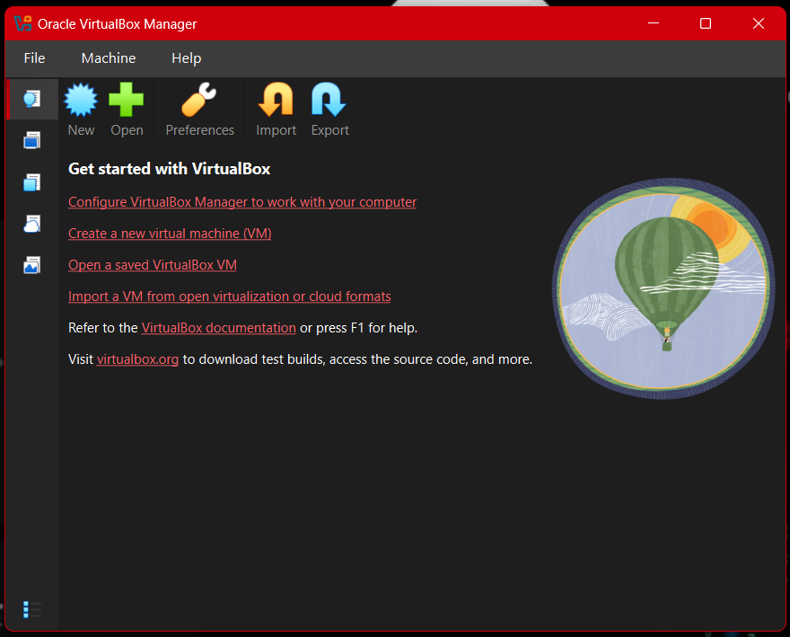
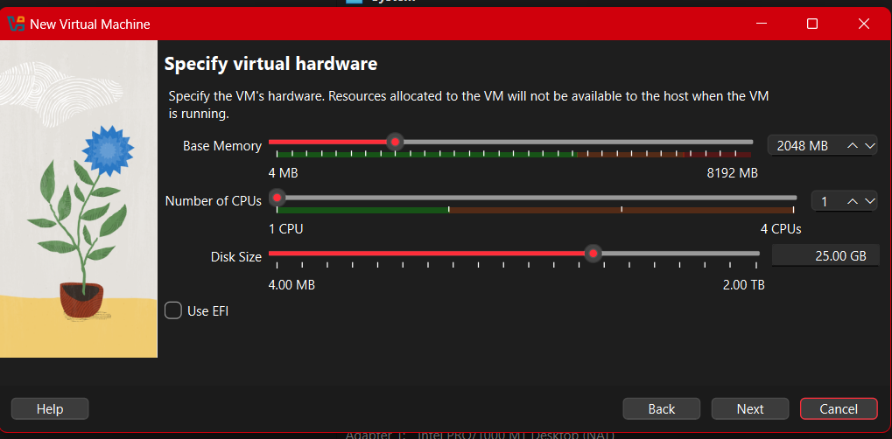
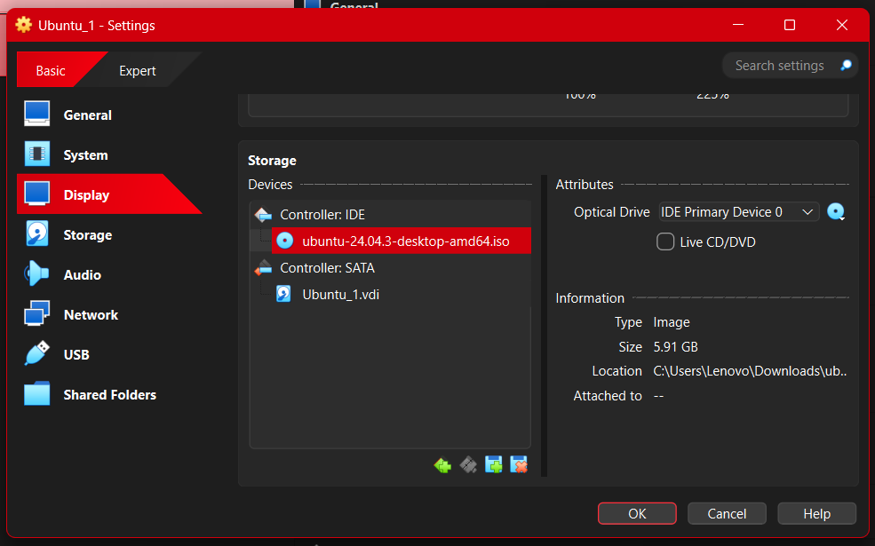
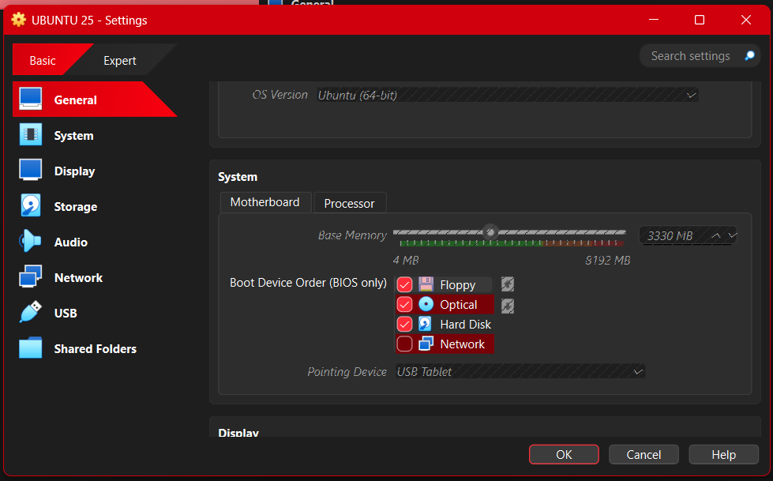
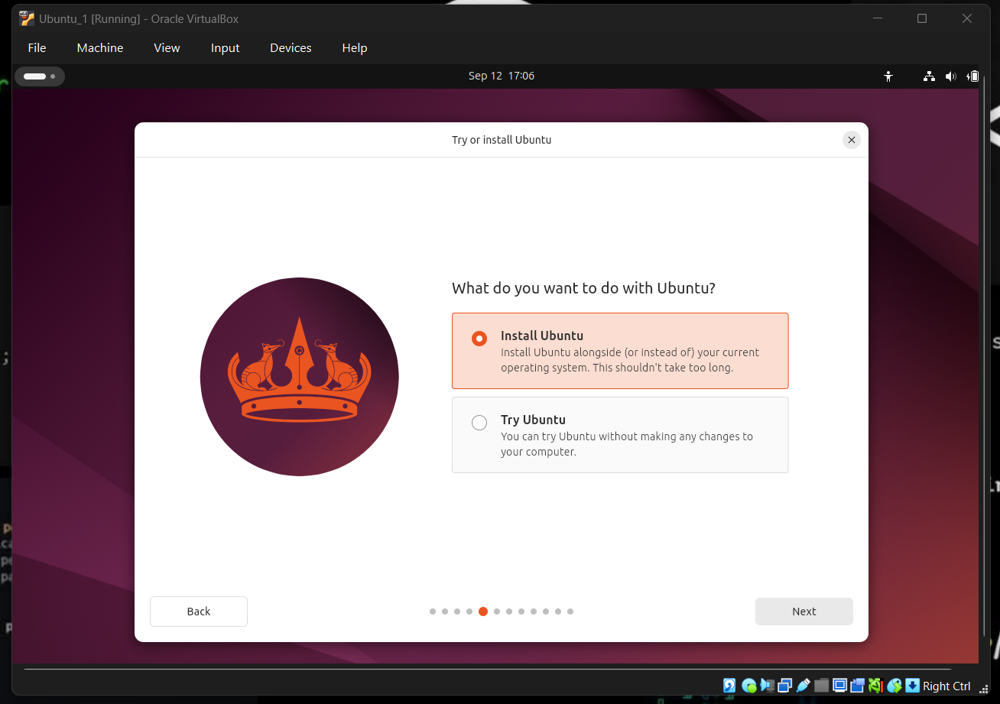
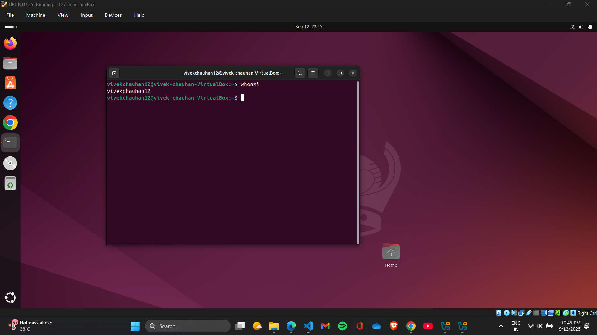

# **EXPERIMENT 1** 
## *Installation of VirtualBox and Setting up linux OS*
---
## 📌 Aim  
To install **Oracle VirtualBox** on a Windows system and set up a Linux operating system (Ubuntu/Fedora/etc.) to practice Linux commands and explore its environment in a virtual machine.

---
## 🛠 Tools & Software Used  
- **Host OS:** Windows 11
- **Virtualization Software:** Oracle VirtualBox *v7.2.0*
- **Guest OS:** Ubuntu 24.04.03

---
## 📋 Procedure
### **Step 1-** Downloading the Oracle Virtual Box
- Open [https://www.virtualbox.org/](https://www.virtualbox.org/) 
- Download the latest version for Windows hosts

### **Step 2-**  Download an installation .iso for a Linux distribution like Ubuntu
-  An .iso file is a disk image of the Linux distribution you want to install. It contains all the necessary files for the operating system.
 

### **Step 3-** Installing the VirtualBox
- Run the downloaded installer.  

- Follow the installation steps and accept default options.
    

- Launch Oracle VirtualBox after installation.
  

### **Step 4-** Creating a new Virtual machine -  Ubuntu 
- Create a new virtual machine by clicking on the "New" or "Create" button.
   

- Follow the on-screen instructions to set up the virtual machine. This includes specifying the name, location, and specifications for the virtual machine, such as the amount of RAM and storage allocated.  
   

- A summary will be shown about the VM to be created
  

- Adding `ubuntu-24.04.3-desktop-amd64.iso` file in **Stoage** under the **Controller:IDE** by clicking on the empty optical drive.
  

- Completing the virtual machine setup by following the remaining on-screen instructions involving configuring network settings, and specifying storage options,etc.
  

- Installing and setting up the `Ubuntu 24.04` by following th einstalltion prompts and providing the required information such as username, password.
  

- After the installation is complete we will have a fully functional **Linux Virtual Machine** running with **VirtualBox**.

---
## ✅ Observations

- Oracle VirtualBox was installed successfully without any issues.
- The Linux OS booted and installed properly inside the virtual machine.
- Terminal commands were executed successfully.

---
## 🧠 Conclusion

The experiment helped me install and configure Oracle VirtualBox and set up a Linux operating system in a virtual environment.

