# <h1 style="background-color: orange;">EXPERIMENT 2 - Linux File systems, Permissions & Commands</h1>

-------------------------------------------------------------------------
Name: Vivek Chauhan   SAP id:590029184    Date:09/09/2025

--------------------------------------------------------------------------
##  Aim
To understand the structure of the Linux file system, manage file permissions and ownership, and practice essential Linux commands.

---------------------------------------------------------------------------
## Tools & Software Used 
- **Operating System:** Ubuntu running on Oracle VirtualBox  
- **Terminal Emulator:** GNOME Terminal 
- **Shell:** Bash (*Bourne-Again Shell*)

---------------------------------------------------------------------------
## <h1 style="background-color: pink;">Linux File Systems </h1>
- The Linux file system is a structured and hierarchical way of storing and organizing files and directories.
- Linux treats everything as part of a single directory tree starting from the root directory `/`
- To view all files and directories in the root `/` directory along with their details such as *permissions*, *ownership*, etc.
We can use the command
```
ls -l /
```
 ### Output:
  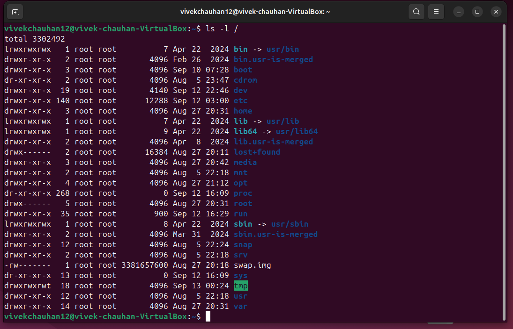 <br><br>

---------------------------------------------------------------------------
## <h1 style="background-color: pink;">File Permissions and Ownership</h1>

- Every file and directory in Linux has three types of permissions:
  - `r` *read*
  - `w` *write*
  - `x` *execute*

- Categories of Users:
  - Owner
  - Group 
  - Others

- Using the `ls -l` command to see the permission and ownership for a file `file1.txt`

 ### Output:
  <br><br>

---------------------------------------------------------------------------

## <h1 style="background-color: pink;"> Modifying Permissions</h1>
  ### Using the `chmod` command
- To change the permission and make `myfile.txt` executable for the user, we can use the command
```
chmod u+x myfile.txt
```
 ### Output:
 <br><br>
- We can also change permissions using numeric mode 
```
chmod 744 myfile2.txt
chmod 754 myfile2.txt
```
 ### Output:
 <br><br>

---------------------------------------------------------------------------

## <h1 style="background-color: pink;">Basic Navigation Commands</h1>

### 1. `ls` - List Directory content
- `ls` - *List files in current directory*
- `ls - l` - *List with detailed information*
- `ls - a` - *List all files using hidden ones*
- `ls - la` - *Combined option for viewing detailed view with hidden files*

 ### Output:
- `ls`:
 <br><br>

- `ls -l`:
 <br><br>

- `ls -a`:
 <br><br>

- `ls -la`:
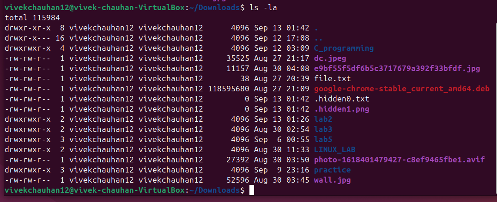 <br><br>

---------------------------------------------------------------------------
### 2. `pwd` - Print working Directory
- Shows your current location in the file.
 ### Output:
  <br><br>

---------------------------------------------------------------------------
### `cd` - Change Directory
- `cd`- *Go to home directory*
- `cd /home/vivekchauhan12/Downloads/lab2`- *Go to a specific directory*
- `cd ..` - *Go up one level*
- `cd -` - *Go to previous directory*
- `cd /` - *Go to root directory*
 #### Output:
   <br><br>

---------------------------------------------------------------------------
### 3. `mkdir` - Make a directory 
 #### Syntax
  ```
  mkdir [options] directory_name
  ```
- **Creating a single directory**
   `mkdir directory_name`<br><br>

- **Creating multiple directories at once**
   `mkdir directory_1 directory_2 directory_3`<br><br>

- **Creating nested directories**
   `mkdir -p parent_directory/child_directory`<br><br>

- **Creating directory with special permissions**
   `mkdir -m mode directory_name`<br><br>

 #### Output:
 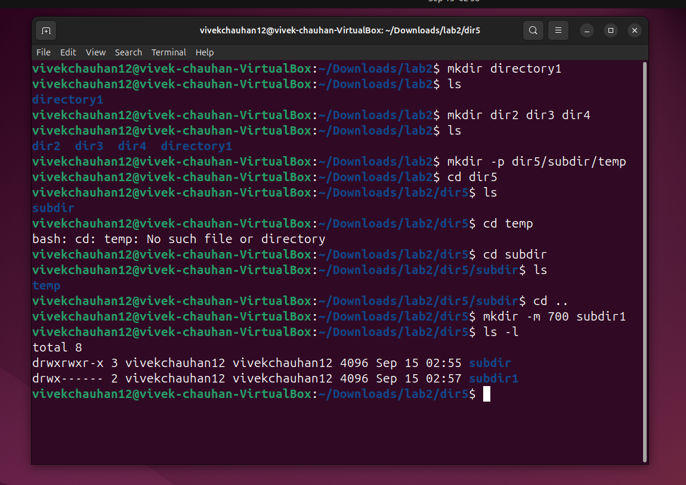 <br><br>

---------------------------------------------------------------------------
### 4. `rmdir` - Remove Empty Directory
 #### Syntax
 ```
 rmdir [options] directory_name
 ```
- **Remove an empty directory**
   `rmdir directory_name`<br><br>

- **Remove multiple empty directories**
   `rmdir directory_1 directory_2 directory_3`<br><br>

- **Remove nested empty directories**
   `rmdir -p parent_directory/child_directory`<br><br>

 #### Output:
  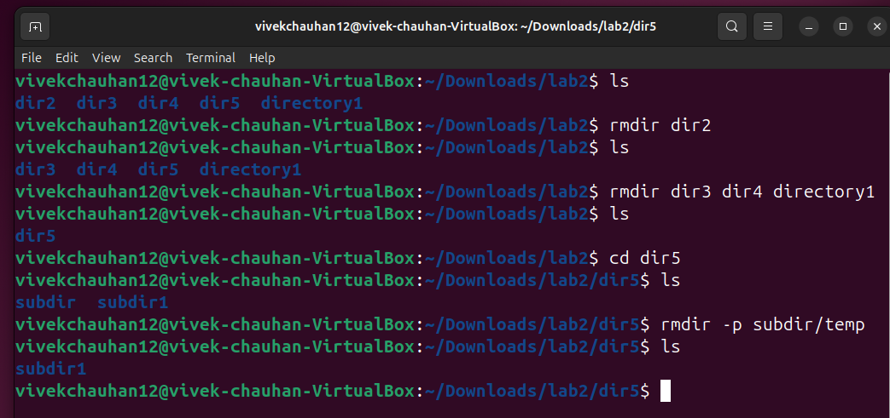 <br><br>

---------------------------------------------------------------------------
##  <h1 style="background-color: pink;">File Operations</h1>

 ### 1. `touch` - Creates files
  -  The `touch` command is used to create empty files or to update timestamps of existing files. 
  #### Syntax
   ```
    touch [options] file_name

   ```
   - **Creating a single file**
      `touch file_name`<br><br>

   - **Creating multiple files at once**
      `touch file1_name file2_name file3_name`<br><br>

   #### Output:
   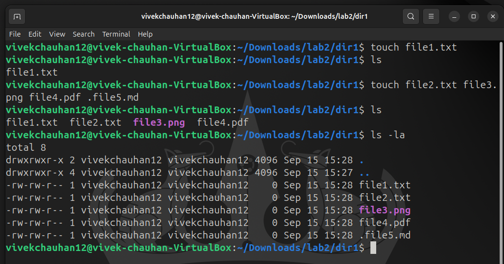<br><br>

---------------------------------------------------------------------------
 ### 2. `cp` - Copying files and directories
  
  - The `cp` command is used to copy files from one location to another.  
  #### Syntax 
  ```
  cp [options] source destination
  ```
  - **Copy a single file** - Copies the content of the source file to the destination file.
    `cp source_file destination_file`<br><br>
  
  - **Copy multiple files to a directory** - Copies all the files to the given destination directory at once.
    `cp source_files destination_directory_path`<br><br>

  - **Copy a directory recursively** - Copy all the files and subdirectories of the source directory to the destination directory.
    `cp -r [source] [destination]`<br><br>
  
  - **Copy and show details** - Display each file being copied.
    `cp -v [source] [destination]`<br><br>

  - **Copy with confirmation** - prompts for confirmation before overwriting a file.
    ` cp -i [source] [destination]`<br><br>

  #### Output:
  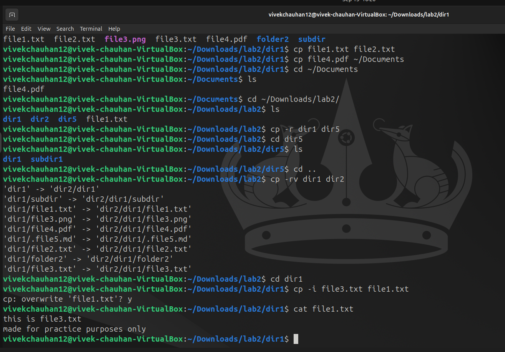<br><br>

---------------------------------------------------------------------------
 ### 3. `mv` - Move and rename
  - `mv` command is used to move files and directories from one place to another.
  
  #### Syntax 
  ```
   mv [options] source destination
  ```
  - **Move file to different directory**
    `mv source_file destination_directory`<br><br>
  
  - **Move multiple files**
    ` mv source_files destination_directory`<br><br>

  - **Rename a file**
    ` mv old_name new_name`<br><br>
  
  - **Rename a directory**
    ` mv old_name new_name`<br><br>

  #### Output:
  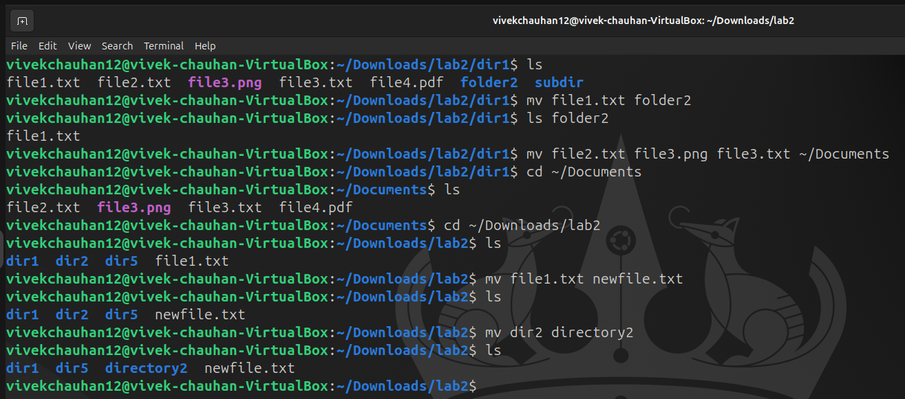 <br><br>

---------------------------------------------------------------------------
 ### 4. `rm` - Remove files and directories
  - `rm` command is used to remove files permanently.
 
  #### Syntax
  ```
  rm [options] file_name
  ```
  - **Remove a file**
    `rm file_name` <br><br>

  - **Remove multiple files**
    ` rm file_names` <br><br>
 
  - **Remove directory and its content**
    ` rm -r directory_name` <br><br>

  - **Forced removal without confirmation**
    ` rm -f file_name` <br><br>

  - **Confirmable removal**
   ` rm -i file_name` <br><br>

  #### Output:
  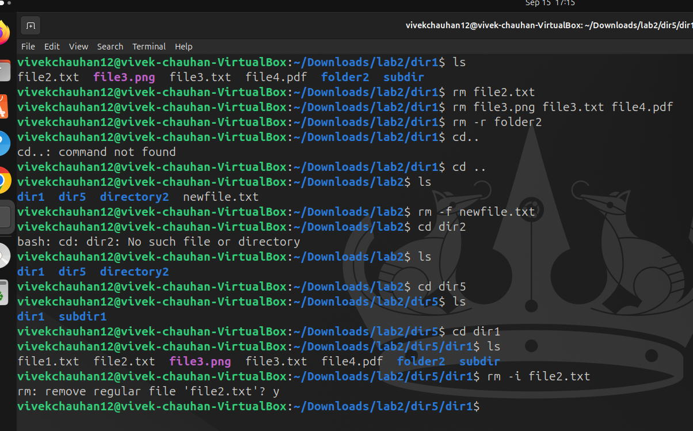 <br><br>

---------------------------------------------------------------------------
##  <h1 style="background-color: pink;">File viewing and Editing</h1>

 ### 1. `cat` - Used for viewing, creating and merging files
  - The `cat` command is used to display the content of files, create new files or combine multiple files.
  
  #### Syntax
  ```
  cat [options] file_name
  ```

  - **To display the content of files**
    `cat file_name` <br><br>
  
  - **To display multiple files together**
    ` cat file_names` <br><br>
  
  - **To create a new file**
    ` cat > file_name` <br><br>

  - **Merging files into a new file**
    ` cat file1 file2 > file_name` <br><br>
  
  - **To display all output lines with numbers**
    ` cat -n file_name` <br><br>

   - **To display all non-empty output lines with numbers**
    ` cat -b file_name` <br><br>

  #### Output:
  <br><br>
  <br><br>

---------------------------------------------------------------------------
 ### 2. `head` - Viewing the beginning of files
  - The `head` command is used to view the first few lines of a file.

  #### Syntax 
  ```
  head [options] file_name
  ```

  - **To display the first 10 lines of a file (*default*)**
    ` head file_name`<br><br>
  
  - **To display the first 5 lines**
    `head -n 5 file_name`<br><br>
  
  - **To display the first 20 bytes of a file**
    ` head -c 20 file_name`<br><br>

  #### Output:
  <br><br>

---------------------------------------------------------------------------
 ### 3. `tail` - Viewing the end of files
  - The `tail` command is used to view the last few lines of a file.

  #### Syntax
  ```
  tail [options] file_name
  ```
  - **To display the last 10 lines of a file (*default*)**
    ` tail file_name`<br><br>
  
  - **To display the last 5 lines of a file (*default*)**
    ` tail -n 5 file_name`<br><br>

  - **To display the last 20 bytes of a file**
    ` tail -c 20 file_name`<br><br>
  
  - **To monitor a file in real time**
    ` tail -f file_name` <br><br>

  #### Output:
  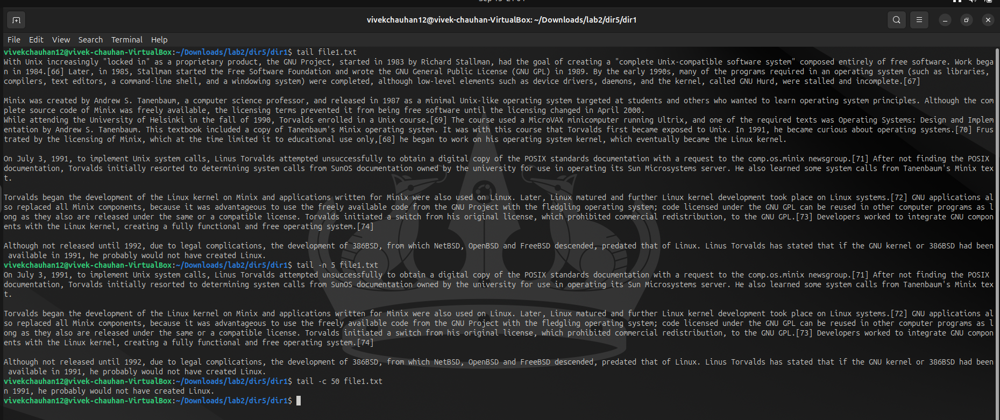<br><br>
  <br><br>

---------------------------------------------------------------------------
## <h1 style="background-color: pink;"> Text editors</h1>
 ### 1. Nano
  - NANO is a text editor that works directly from the terminal, useful for creating and editing files.
  
  #### Output:
   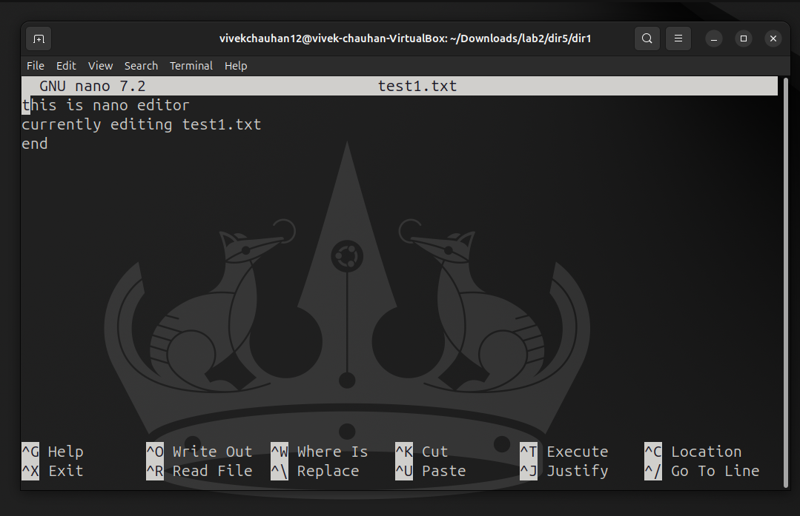<br><br>
   <br><br>

---------------------------------------------------------------------------
 ### 2. Vim
  - VIM is an advanced text editor with features like syntax highlighting, efficient navigation and powerful editing commands.

  #### OUTPUT:
   <br><br>
   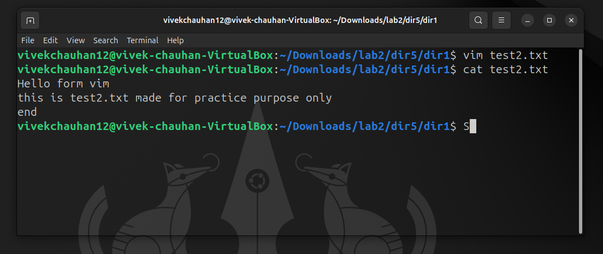<br><br>

---------------------------------------------------------------------------

## <h1 style="background-color: pink;"> User Management</h1>
 ### 1. `whoami` - Display the current username 

 ### 2. `who` - Display all users currently logged into the system

 ### 3. `passwd` - To change user password

 ### 4. `sudo ` - To run commands with administrative privileges
  -For tasks like updating and installing packages or editing system files, the `sudo` command is used
  - `sudo` grants root privileges to the user to run commands.
  #### Syntax
   ```
    sudo command
   ```
  
 ### OUTPUT:
  
  <br><br>

---------------------------------------------------------------------------
  
 ## <h1 style="background-color: pink;"> System Information</h1>
  ### 1.`uname` - To display details about Linux system

   #### Syntax
   ```
    uname [options]
   ```
   - **To display basic system info**
     `uname`<br><br>
    
   - **To display all system info**
     `uname -a`<br><br>

   - **To display kernel version**
     `uname -r`<br><br>

   - **To display machine hardware info**
     `uname -m`<br><br>

   - **To display OS info**
     `uname -o`<br><br>

   #### OUTPUT:
   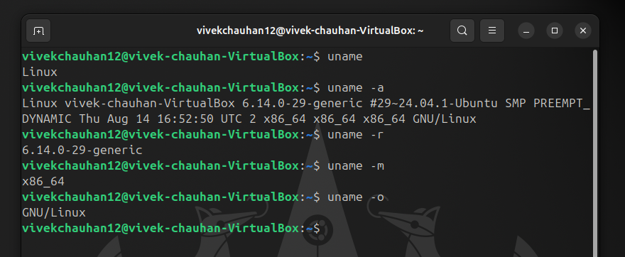<br><br>

---------------------------------------------------------------------------
  ### 2.`df` - To display the information about disk space usage
   
   #### Syntax
   ```
   df [options] [file_systems]
   ```
   - **To display basic disk usage**
    `df`<br><br>

   - **To display disk usage in human human-readable format**
    `df -h`<br><br>

   - **To display file system type**
    `df -T`<br><br>
  
   #### OUTPUT:
   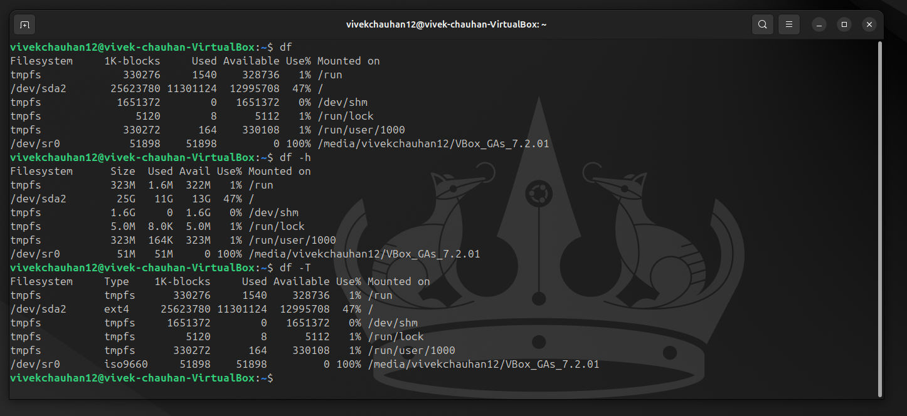<br><br>

---------------------------------------------------------------------------

  ### 3.`top` - shows real-time information 
   - `top` shows real-time info about processes, CPU usage, memory usage and other system resources

  ### OUTPUT:
   <br><br>

---------------------------------------------------------------------------
  ### 4. `history` - shows a list of commands that have been executed in the terminal

   #### Syntax 
   ```
   history
   ```
   - **To display command history**
     `history`<br><br>

   - **To display last n commands**
     `history n`<br><br>

   - **To search history**
     `history | grep "search_term"` <br><br>
   
   - **Execute previous command**
     `!!<br><br>

   #### OUTPUT:
   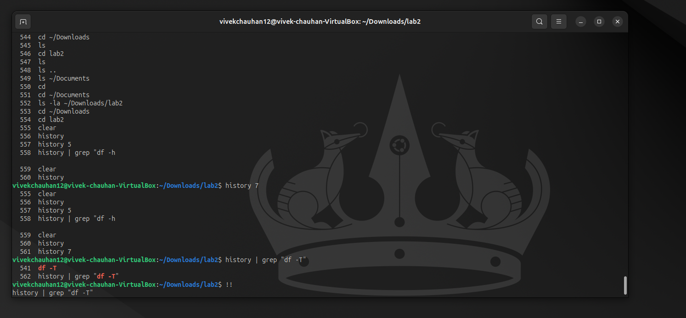<br><br>

---------------------------------------------------------------------------
## <h1 style="background-color: pink;">EXERCISES</h1>
 ### Exercise 1 - File system navigation<br><br>
  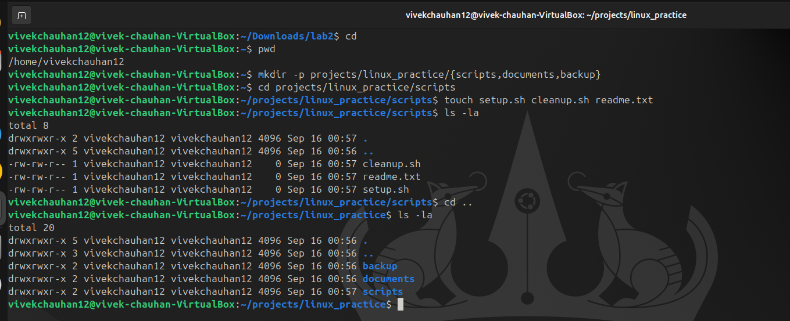<br><br>

---------------------------------------------------------------------------
 ### Exercise 2 - File operations and permissions<br><br>
  <br><br>

---------------------------------------------------------------------------
 ### Exercise 3 - Text Editing and viewing<br><br>
  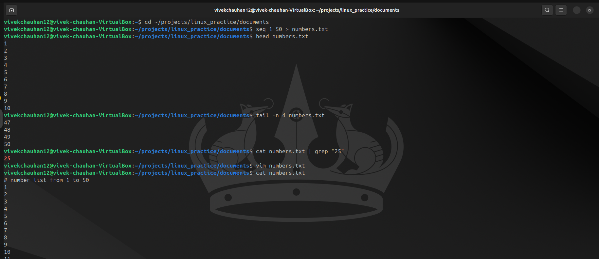<br><br>

---------------------------------------------------------------------------
 ### Exercise 4 - System exploration<br><br>
  <br><br>

---------------------------------------------------------------------------
 ### Exercise 5 - Cleanup <br><br>
 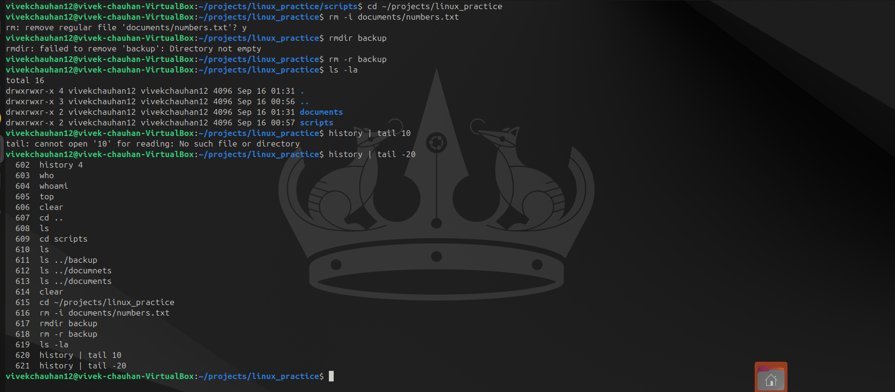<br><br>

---------------------------------------------------------------------------
##  <h1 style="background-color: orange;"> OBERVATIONS</h1>
 
 - The Linux file system structure was explored using commands.

 - File permissions and ownership were checked and modified.

 - Directories were navigated, and file operations were performed.

 - File contents were viewed and edited with text editors.

 - User management tasks were carried out using appropriate commands.

 - System information and resource usage were monitored during the experiment.

-----------------------------------------------------------------------------

##  <h1 style="background-color: orange;"> CONCLUSION</h1>
 The experiment provided practical experience in using various Linux commands related to file systems, permissions, navigation, file operations, editing, user management, and system monitoring.

------------------------------------------------------------------------------
