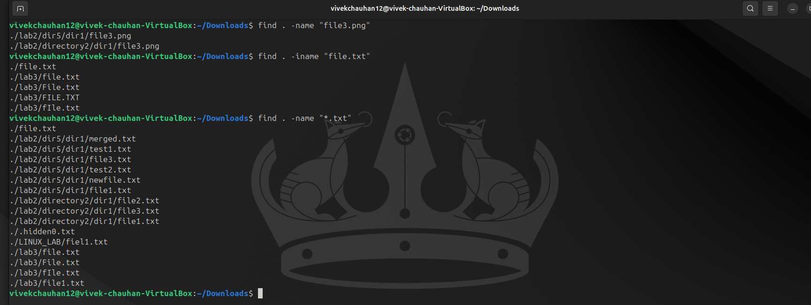
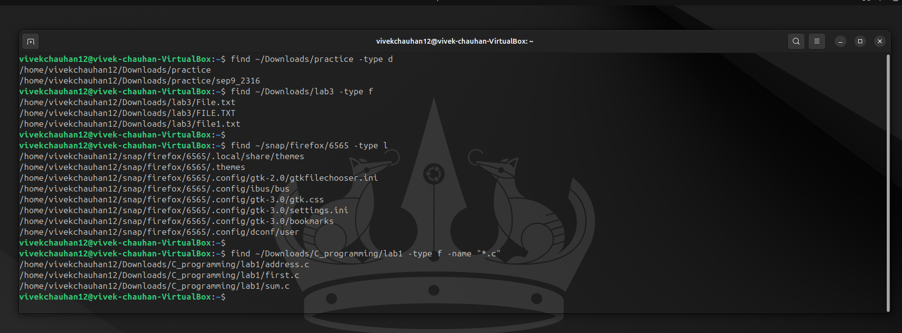
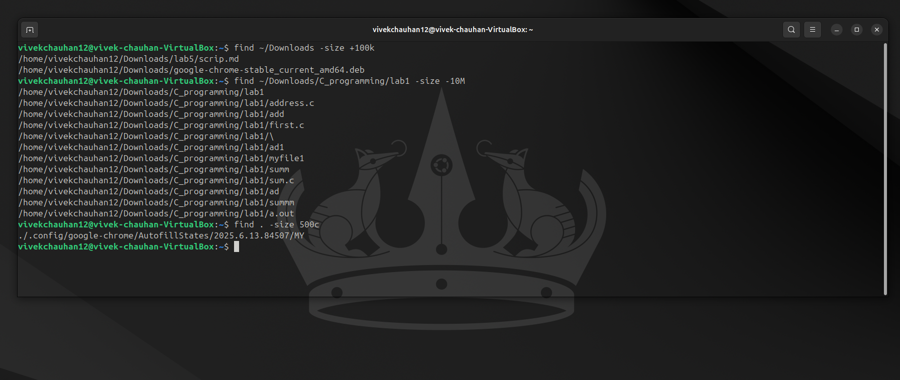
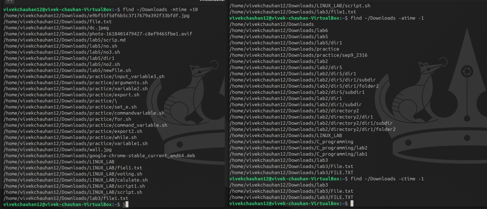
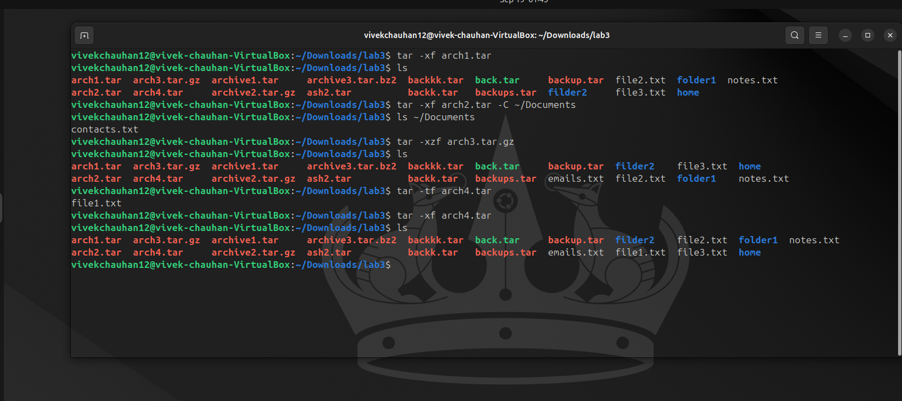
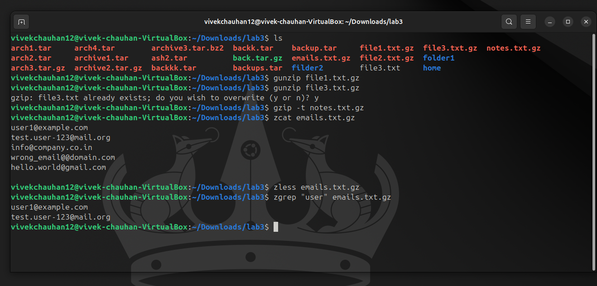
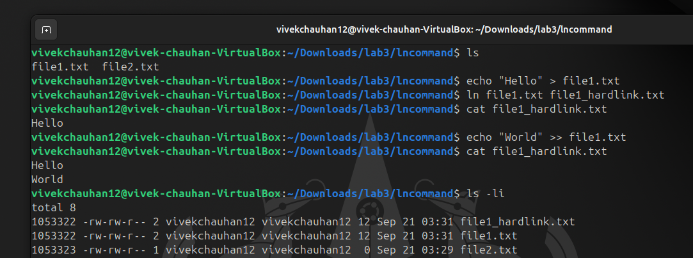
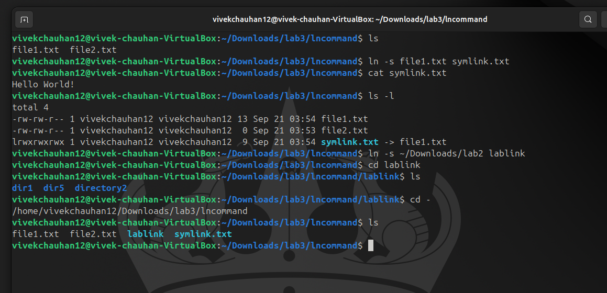

# <h1 style="background-color: orange;"> EXPERIMENT 3 - Advanced File and Directory Operations</h1>

---------------------------------------------------------------------------
## 📌 Aim
   To understand and perform advanced file and directory operations in Linux using commands for searching, compressing, archiving, and linking files effectively.


---------------------------------------------------------------------------
## 🛠 Tools & Software Used 
- **Operating System:** Ubuntu running on Oracle VirtualBox  
- **Terminal Emulator:** GNOME Terminal 
- **Shell:** Bash (*Bourne-Again Shell*)

---------------------------------------------------------------------------
## <h1 style="background-color: pink;">File Searching with `find`</h1>
 - The find command is used to search for files and directories based on different criteria like name, type, size, permissions, etc. It searches recursively in directories.<br><br>

 ### Syntax 
  ```
  find [path] [options] [expression]
  ```
  ### 1. Search by `name`:
  - **Find files by exact name** 
     `find [path] -name "*file_name*"`<br><br>

  - **Case -insensitive search**
     `find [path] -iname "*file_name*"`<br><br>

  - **Wildcard search**
     ` find [path] -name "pattern*pattern"`<br><br>

  ### Output:
    <br><br>

  ### 2. Search by `type`:
  - **To find all directories**
     `find [path] -type d `<br><br>
   
  - **To find all files**
     `find [path] -type f `<br><br>

  - **To find all symbolic links**
     `find [path] -type l `<br><br>

  - **To find by `type` combined with `name`**
     `find [path] -type _ name "file_name"`

  ### Output:
   <br><br>

  ### 2. Search by `size`:
  - **Find files larger than 10 KB**
    `find [path] -size +10k` <br><br>
  
  - **Find files smaller than 1 MB**
    `find [path] -size -1M`<br><br>

  - **Find files exactly of 500 bytes**
    `find [path] -size 500c`

  ### Output:
   <br><br>

  ### 3. Search by `time`:
  - **Modified more than 10 days ago**
     `find [path] -mtime +10`<br><br>

  - **Accessed in last 24 hours**
     `find [path] -atime -1`<br><br>
  
  - **Changed in last 24 hours**
     `find [path] -ctime -1`<br><br>

  ### Output:
   <br><br>

  ### 4. Search by permission `perm`:
  - **To find files with specific permission**
     `find [path] -perm [mode]`<br><br>

  - **To find files with at least specific permission**
     `find [path] -perm -[mode]`<br><br>
  
  - **To find executable files**
     `find [path] -perm /111`<br><br>

  ### Output:
   <br><br>

---------------------------------------------------------------------------
## <h1 style="background-color: pink;">File Searching with `grep`</h1>
 - `grep` (*Global Regular Expression Print*) is a command-line utility used to search for text patterns in files or command outputs.

 ### Syntax
  ```
  grep [options] pattern [files{s}]

  ```
 - **Search for pattern in a file**
    ` grep "pattern" [filename or path]`<br><br>
 
 - **Case insensitive search for pattern in a file**
    ` grep -i "pattern" [filename or path]`<br><br>

 - **Search for pattern in multilple files**
    ` grep "pattern" [*filename]`<br><br>   

 - **Search for pattern reacursively in a directory**
    ` grep -r "pattern" [path]`<br><br>   

 - **Search for pattern in a file and show line numbers**
    ` grep -n "pattern" [filename or path]`<br><br>

 - **To count matches**
    ` grep -c "pattern" [filename or path]`<br><br>

 - **Show only the matchong word**
    ` grep -o "pattern" [filename or path]`<br><br>

 - **Match whole word only**
    ` grep -w "pattern" [filename or path]`<br><br>

 - **Show only filename(s) that match**
    ` grep -l "pattern" [filename or path]`<br><br>

 - **To search multiple patterns** - grep will match any line that has at least one of the pattern
    ` grep -e "pattern" -e "pattern" -e "pattern" [filename or path]`<br><br>

 - **To highlight matches**
    ` grep --color=auto "pattern" [filename or path]`<br><br>

 - **To show context lines**
    ` grep -A 1 -B 1 "pattern" [filename or path]`<br><br>
    ` grep -C 2 "pattern" [filename or path]`<br><br>

 - **TO search for a pattern in the beginning of a line**
    ` grep "^pattern" [filename or path]` <br><br>

 - **TO search for a pattern in the end of a line**
    ` grep "$pattern" [filename or path]` <br><br>

 - **Extended regex**
    ` grep -E "[A-Za-z0-9._%+-]+@[A-Za-z0-9.-]+\.[A-Za-z]{2,}" [filename or path]` 
    ` greo -E "[0-9+]{3}\-[1-9]{3}\-[0-9]{3}\-[0-9]{4}" [filename or path]`

 ### Output:
   <br><br>
   <br><br>
   <br><br>
   <br><br>

---------------------------------------------------------------------------
## <h1 style="background-color: pink;">Creating files with `tar`</h1>
 - The `tar` command is used to create, view and extract archive files.
 
 ### Syntax 
  ```
  tar [options] [archive-file] [files or directories]

  ```
  ### 1. Creating archives
  - **To create a .`tar` archive file**
     `tar -cvf [archive_name.tar] [files or directories]` <br><br>

  - **To create a compressed `.tar.gz` archive file (*gzip*)**
     `tar -czf [archive_name.tar.gz] [files or directories]`<br><br>

  - **To create a compressed `.tar.bz2` archive file (*bzip2*)**
     `tar -cjf [archive_name.tar.bz2] [files or directories]`<br><br>

   ### Output:
    <br><br>

  ### 2. Extracting archives 
  - **To extract `.tar` archive**
     ` tar -xf [archive_name]` <br><br>

  - **To extract `.tar` archive to a specific directory**
     ` tar -xf [archive_name] -C [path]` <br><br>

  - **To extract `.tar.gz`compressed archive**
     ` tar -xzf [archive_name]` <br><br>

  - **To list `.tar`content without extracting archive**
     ` tar -tf [archive_name]` <br><br>

   ### Output:
    <br><br>

---------------------------------------------------------------------------
## <h1 style="background-color: pink;">File Compression and Decompression with `gzip/gunzip`</h1>
 ### 1. File Compression with `gzip` 
  The `gzip` command is used to compress files with `.gz` extension.

  #### Syntax
   ```
   gzip [options] filename

   ```
 - **To compress a file**
    `gzip [filename(s)]`<br><br>

 - **To keep the original file as well**
    `gzip -k [filename(s)]` <br><br>

  - **To compress with maximum compression**
    `gzip -9 [filename(s)]` <br><br>

  - **To view compression ratio as well**
     `gzip -v [filename(s)]` <br><br>

   ### Output:
    <br><br>
 
  ### 2. File Deompression with `gunzip` 
  The `gunzip` command is used to decompress files with `.gz` extension.

  #### Syntax
   ```
   gunzip [options] filename

   ```
 - **To decompress a file**
    `gunzip [filename(s)]`<br><br>

 - **To keep the original file as well**
    `gunzip -k [filename(s)]` <br><br>

  - **To test integrity**
    `gzip -t [filename(s)]` <br><br>

  - **To view content without decompressing**
     `zcat [filename(s)]` 
     `zless [filename]`
     `zgrep "pattern" [filename(s)]` <br><br>

   ### Output:
    <br><br>
   
------------------------------------------------------------------------
## <h1 style="background-color: pink;">Creatinh links with `ln`</h1>
 - The `ln` command is used to create inks between the files. <br><br>

  ### Syntax
   ```
   ln {target} [link_name]

   ```
 ### 1. Hard links 
  - **To create hard link** 
     `ln [target] [link_name]` <br><br>

  - **To view inode numbers**
     ` ls -li [target] [link_name]` <br><br>

   ### Output:
    <br><br>


 ### 2.Symbolic (soft) links
  ### Syntax
   ```
   ln {target} [link_name]

   ```

  - **To create symbolic link**
     ` ln -s [target] [linkname]` <br><br>

  - **Linking to directories**
     ` ln -s [path] [linkname]` <br><br>

   ### Output:
    <br><br>

---------------------------------------------------------------------------

## <h1 style="background-color: pink;">📋 OBSERVATION</h1> 
- Successfully searched files using `find` and `grep` with different options.  
- Created and extracted archives using `tar`.  
- Compressed and decompressed files with `gzip/gunzip`. 
- Created hard and symbolic links using `ln`.  

---------------------------------------------------------------------------

## <h1 style="background-color: pink;">🧠 CONCLUSION</h1> <br><br>

The experiment helped in understanding advanced file and directory operations in Linux, enhancing efficiency in file management through searching, archiving, compression, and linking techniques.


