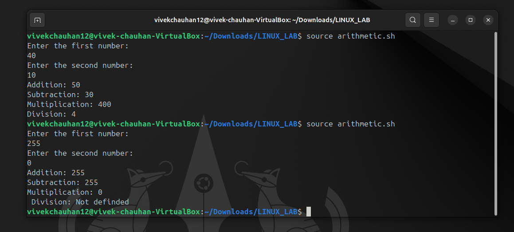

# <h1 style="background-color: orange;"> EXPERIMENT 4 - Shell Programming</h1>
---------------------------------------------------------------------------
Name: Vivek Chauhan   SAP id:590029184    Date:15/09/2025

---------------------------------------------------------------------------
##  Aim
   To learn the fundamentals of Shell Scripting in Linux

---------------------------------------------------------------------------
## Tools & Software Used 
- **Operating System:** Ubuntu running on Oracle VirtualBox  
- **Terminal Emulator:** GNOME Terminal 
- **Shell:** Bash (*Bourne-Again Shell*)

---------------------------------------------------------------------------
## <h1 style="background-color: pink;">TASK 1: Hello World Scrpt</h1>
 **Write a simple shell script that prints `Hello, World!` when executed.**  

  ### Script:
     

  ### Output:
     

---------------------------------------------------------------------------
## <h1 style="background-color: pink;">TASK 2: Personalised Greeting</h1>
  **Create a script that prompts the user to enter their name and then displays a personalized greeting.**   

  ### Script:
     

  ### Output:
     

---------------------------------------------------------------------------
## <h1 style="background-color: pink;">TASK 3: Arithmetic Operations</h1>
**Write a script that takes two numbers as input and performs various arithmetic operations like addition, subtraction, multiplication, and division.**  

  ### Script:
     

  ### Output:
     

---------------------------------------------------------------------------
## <h1 style="background-color: pink;">TASK 4: Voting Eligibility</h1>
**Create a script that asks the user to enter their age and displays a message based on whether they are eligible to vote or not.**   

  ### Script:
     

  ### Output:
     

---------------------------------------------------------------------------
## <h1 style="background-color: pink;"> OBSERVATION</h1> 
 - Successfully created and executed multiple shell scripts in Bash.
 - The "Hello, World!" script verified the basic structure of a shell program.
 - Personalized greeting script demonstrated user input handling.
 - Arithmetic script correctly performed addition, subtraction, multiplication, and division on user-provided numbers.
 - Voting eligibility script applied conditional statements to evaluate user input.

---------------------------------------------------------------------------
## <h1 style="background-color: pink;"> CONCLUSION</h1> 
 The experiment provided hands-on practice with Bash shell scripting, covering the essentials of input/output, variables, arithmetic, and conditional logic.

---------------------------------------------------------------------------
