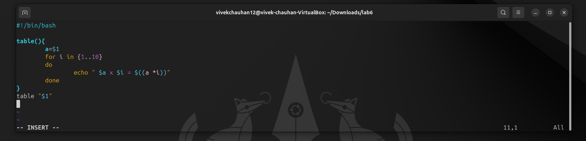

# <h1 style="background-color: orange;"> EXPERIMENT 6 - Shell Programming</h1>

---------------------------------------------------------------------------
## 📌 Aim
   **TTo understand and practically apply Shell Loops, Loop Control statements, Input/Output Redirections, Shell Functions, Regular Expressions, and Script Debugging in Linux**

---------------------------------------------------------------------------
## 🛠 Tools & Software Used 
- **Operating System:** Ubuntu running on Oracle VirtualBox  
- **Terminal Emulator:** GNOME Terminal 
- **Shell:** Bash (*Bourne-Again Shell*)

---------------------------------------------------------------------------
## <h1 style="background-color: pink;">🔄Loops</h1>
 
  ### 1.`for` loop:
   #### Script:
     
 
   #### Output:
     

  ### 2.`while` loop:
   #### Script:
     
 
   #### Output:
      
   
  ### 3.`until` loop:
   #### Script:
     
 
   #### Output:
     

---------------------------------------------------------------------------   
## <h1 style="background-color: pink;">🔄Loop Control using `continue` & `break`</h1>

 ### Using `continue` and `break`:
   #### Script:
     
 
   #### Output:
      

---------------------------------------------------------------------------
## <h1 style="background-color: pink;">⚙️Shell Functions</h1>

 ### 1. Greeting function:
   #### Script:
     
 
   #### Output:
     

 ### 2. Multiplication table function:
   #### Script:
     
 
   #### Output:
      

---------------------------------------------------------------------------
## <h1 style="background-color: pink;">🧩Lab Exercises</h1>

 ### TASK 1: Palindrome Check
   #### Script:
     
 
   #### Output:
     
 
 ### TASK 2: GCD & LCM
   #### Script:
     
 
   #### Output:
     

 ### TASK 3: Sorting Numbers
   #### Script:
     
 
   #### Output:
     

---------------------------------------------------------------------------
## <h1 style="background-color: pink;">📋 OBSERVATIONS</h1>
- Loops and loop control statements executed correctly.
- Shell functions allowed reusable code blocks.

---------------------------------------------------------------------------
## <h1 style="background-color: pink;">🧠 CONCLUSION</h1> 
 Learned to use loops, functions, IO redirection, and regex in Bash scripts

---------------------------------------------------------------------------

