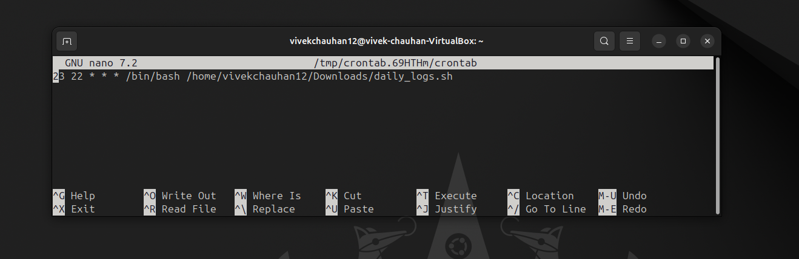

# <h1 style="background-color: orange;">  **Script Explanation**  </h1>

------------------------------------------------------------------
#### <h1 style="background-color: pink;">STEP 1: Identify the user</h1>

````
USER_NAME=$(whoami)
echo "Script run by: $USER_NAME"

````
###### **Main idea: The script identifies the currently logged-in user and displays their username**
- **`  whoami  `** prints the name of the effective user running the process.

- **`  USER_NAME=$(whoami)  `** captures that output into the variable USER_NAME

------------------------------------------------------------------
#### <h1 style="background-color: pink;">STEP 2: Identify the user</h1>

###### **Main idea: It creates a directory (if it doesn’t exist) for storing daily log files named with the current date**
Then it logs:
- Current user and date
- System uptime
- Top 5 CPU-consuming processes
- Disk usage summary

```
LOG_DIR=/home/vivekchauhan12/Documents/dailylogs
mkdir -p "$LOG_DIR"
LOGFILE="$LOG_DIR/log_$(date +%Y-%m-%d).txt"
```
**<u>  In this block   </u>** 
- **` LOG_DIR=/home/vivekchauhan12/Documents/dailylogs `** defines where logs will live. Here I'm using absoulte path which is crucial for cron later.
- **` mkdir -p "$LOG_DIR"  `** creates the directory and any missing parents 
- **` LOGFILE="$LOG_DIR/log_$(date +%Y-%m-%d).txt" `** creates a daily files with name like **` log_2025-10-14.txt `**.

```{
  echo "User: $USER_NAME"
  echo "Date: $(date)"
  echo "Uptime:"
  uptime
  echo "Top 5 CPU processes:"
  ps -eo pid,comm,%mem,%cpu --sort=-%cpu | head -n 6
  echo "Disk usage:"
  df -h
} > "$LOGFILE"
echo "Daily log saved: $LOGFILE"
```
**<u>  In this block   </u>** 
- **` { ... } > "$LOGFILE" `**: everything inside the braces is redirected once into "$LOGFILE" (overwrites).

------------------------------------------------------------------
#### <h1 style="background-color: pink;">STEP 3: Weekly Archiving</h1>
###### **Main idea: Every Monday, it automatically compresses the logs from the past week into a .tar.gz archive inside an archive folder**

```ARCHIVE_DIR=/home/vivekchauhan12/Documents/dailylogs/archive
mkdir -p "$ARCHIVE_DIR"

DAY_OF_WEEK=$(date +%u)  # 1 = Monday
if [ "$DAY_OF_WEEK" -eq 1 ]; then
  tar -czf "$ARCHIVE_DIR/weeklylogs_$(date +%Y-%m-%d).tar.gz" -C "$LOG_DIR" .
  echo "Weekly archive created."
fi
```
**<u>  In this block   </u>** 
- **`  date +%u  `** returns day number 1..7 (1 = Monday).
- The  **`  if  `** checks whether today is Monday. If yes, it creates a weekly archive.
- **` tar -czf <archive> -C "$LOG_DIR" .`**:
 - **` -c `** create, **` -z  `** gzip, **` -f  `** file.
 - **` -C "$LOG_DIR" .`**  tells tar to **` cd `** into **` $LOG_DIR `** and archive **` . `** — this avoids nesting the full path inside the archive and results in a clean archive containing the log files directly.

------------------------------------------------------------------
#### <h1 style="background-color: pink;">STEP 4: Move Logs Older Than 7 Days</h1>

###### **Main idea: Any log file older than 7 days is moved to the archive folder automatically to save space**

```
for file in "$LOG_DIR"/log_*.txt; do
  if [ -f "$file" ] && [ $(find "$file" -mtime +7) ]; then
    mv "$file" "$ARCHIVE_DIR/"
  fi
done

```
**<u>  In this block   </u>** 
- This loop goes through each log file inside the log directory **` $LOG_DIR `** that matches the pattern **` log_*.txt `**.
- For each matching file, it stores the file’s full path in the variable **` $file `**
- **` [ -f "$file" ] `** ensures the item is a regular file (not a directory or something else)
- **` [ $(find "$file" -mtime +7) ] `** uses the find command to check if the file was last modified more than 7 days ago.
- The **` mv `** command transfers the selected log file into the archive directory.
- **` $ARCHIVE_DIR `** is the folder where old logs are stored to keep the main log directory clean and manageable.
- This prevents the daily log folder from becoming too large.

------------------------------------------------------------------
#### <h1 style="background-color: pink;">STEP 5: Menu for Manual Operations</h1>

###### **Main idea: The script includes a menu-driven interface for manual control**
  1. **Archive all logs manually**
  2. **Move logs older than 7 days**
  3. **View the latest log**
  4. **Exit**

```
echo ""
echo "Select an option:"
echo "1) Archive all logs manually"
echo "2) Move logs older than 7 days manually"
echo "3) View latest log"
echo "4) Exit"
read -p "Enter your choice (1-4): " choice
``` 
**<u>  In this block   </u>**
- Shows an interactive menu and reads user choice with **` read -p `**.

```
case $choice in
  1)
    echo "Archiving all logs..."
    tar -czf "$ARCHIVE_DIR/manual_archive_$(date +%Y-%m-%d).tar.gz" -C "$LOG_DIR" .
    echo "Manual archive created."
    ;;
 
```
**<u>  In this block   </u>**
- First case if the input is **` 1 `** from the user then - 
 - Create and compress archive: **` tar -czf `** tells the system to create  **` -c `** a gzip-compressed **` -z `** archive and save it with a specified filename  **` -f `**.
 - Archive filename with date: **` "$ARCHIVE_DIR/manual_archive_$(date +%Y-%m-%d).tar.gz" `** names the archive using the current date, storing it in the archive folder.
 - Archive contents from log directory:**` -C "$LOG_DIR" `** changes to the log folder so all its files **` . `** are included in the archive.

```
2)
    echo "Moving logs older than 7 days to archive..."
    for file in "$LOG_DIR"/log_*.txt; do
      if [ -f "$file" ] && [ $(find "$file" -mtime +7) ]; then
        mv "$file" "$ARCHIVE_DIR/"
        echo "Moved $file to archive"
      fi
    done
    ;;
```
**<u>  In this block   </u>**
- Second case if the input is` 2 `.
 - **` echo `** prints **` "Moving logs older than 7 days to archive..." `** to inform the user that old logs are being processed.
 - Loop through logs: for file in ` "$LOG_DIR"/log_*.txt; do ... done `iterates over all log files in the log directory.
 - **` if `**statement Checks if each file exists and is older than 7 days **` -mtime +7 `**, then **` mv `**moves it to the archive folder and prints confirmation.

```
3)
    echo "Latest log content:"
    cat "$LOGFILE"
    ;;
  4)
    echo "Exiting..."
    exit 0
    ;;
  *)
    echo "Invalid choice!"
    ;;
esac
```
**<u>  In this block   </u>**
- Option 3: if the input is **` 3 `** displays **` Latest log content: `** and uses **` cat "$LOGFILE" `**to show the contents of the most recent log file.
- Option 4: Prints **` Exiting... `**and ends the script using **` exit 0 `**.
- Default case **` * `**: If the user enters anything other than 1–4, it shows **` Invalid choice! `**.

------------------------------------------------------------------
#### <h1 style="background-color: pink;">Scheduling Script using Cron</h1>

- The script **` daily_logs.sh `** is scheduled to run automatically every day at **` 23:22 `** using the command **` crontab -e `**.

 <br><br>

- Cron reads the schedule and executes the script at the specified time without any manual intervention.

- The full path **` /home/vivekchauhan12/Downloads/daily_logs.sh `** is used to ensure cron can locate the script.

- Using **` crontab -l `** we can seet to ensure that the job is scheduled rightly at our specified time.
 <br><br>

- This automation ensures that daily logs are created, old logs are archived, and the system monitoring process runs consistently without the user having to run the script manually.


------------------------------------------------------------------
#### <h1 style="background-color: orange;">OBSERVATIONS</h1>

- The script successfully creates a daily log file containing user **info**, **date/time**, **system uptime**, top **CPU-consuming processes**, and **disk usage**.
- The script is automated using **Crontab**, scheduled to run daily at **` 23:22 `**, ensuring logs are generated and managed without manual execution.
- Daily log files are automatically named with the current date, making them easy to organize and sort.
- The script creates directories **` dailylogs `** and **` archive `** automatically if they don’t exist, ensuring smooth execution.
- On Mondays, it automatically generates a weekly compressed archive **` .tar.gz `** of all logs.
- Logs older than **7 days** are automatically moved to the archive folder, preventing clutter in the main log directory.
- The manual menu allows the user to archive all logs, move old logs, view the latest log, or exit.
- Compressed archives store logs in a neat and space-efficient manner.

------------------------------------------------------------------
#### <h1 style="background-color: orange;">CONCLUSION</h1>
 The project demonstrates practical skills in **Linux automation** and **shell scripting**.

------------------------------------------------------------------
------------------------------------------------------------------


